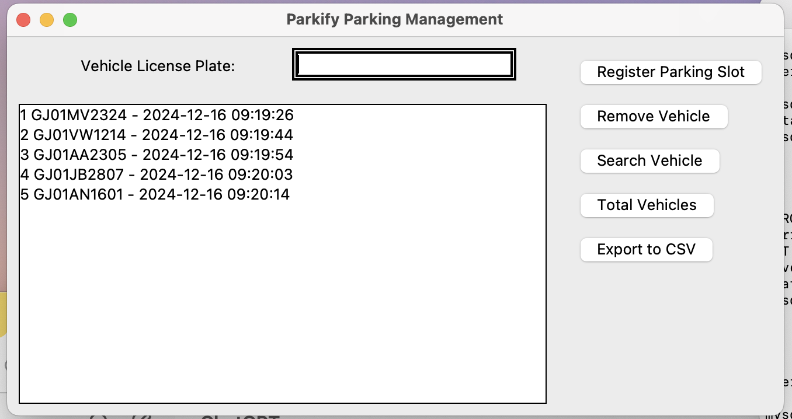

## Introduction
Parkify is a comprehensive parking management solution
designed to streamline the complexities of parking operations
across facilities, whether large or small. Built with a focus on
user experience, it combines a robust MySQL database for
secure, organized data storage with a Python and Tkinter
interface that prioritizes intuitive navigation and ease of use.
With Parkify, administrators can efficiently manage parking
spaces, track vehicle entries and exits, monitor occupancy levels
in real time, and generate reports effortlessly. The system’s
interactive interface is carefully crafted to minimize the learning
curve for users, ensuring that they can quickly adapt and
maximize efficiency from the start. The platform is highly
adaptable, making it suitable for varied settings—be it office
complexes, shopping malls, or private garages. Security and
reliability are key to Parkify’s design. The MySQL database not
only offers secure data handling but also supports extensive
scalability, making it easy to expand as parking facilities grow.
In combination with Python’s powerful functionality and
Tkinter’s responsive GUI framework, Parkify delivers a
seamless experience for both administrators and users.

## Features
1. Vehicle Registration
2. Parking Slot Display and Assignment
3. Vehicle Removal with Tarriff
4. Real-Time List Display
5. Search Functionality
6. Total Vehicles Display
7. Data Export
8. Operation Log Maintenance
